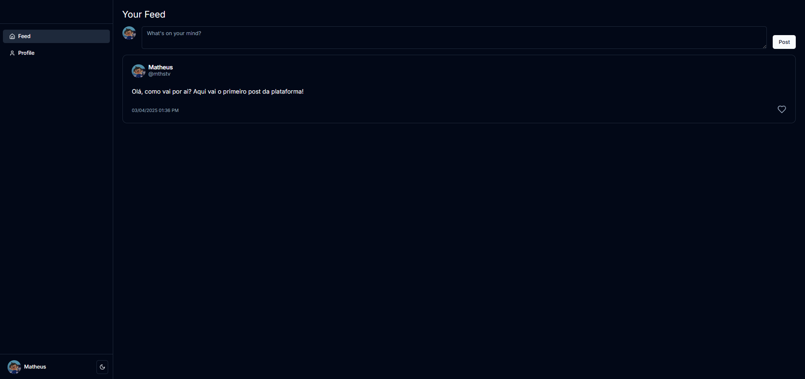
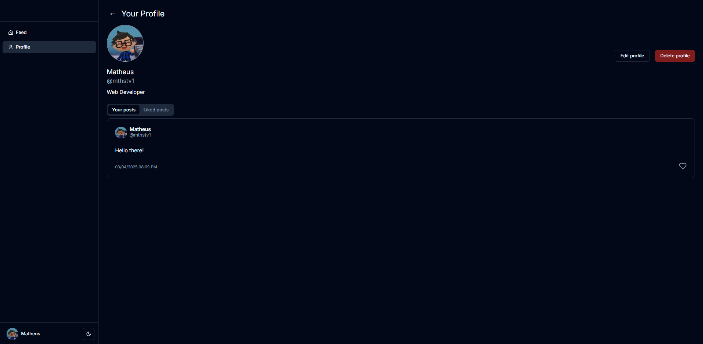
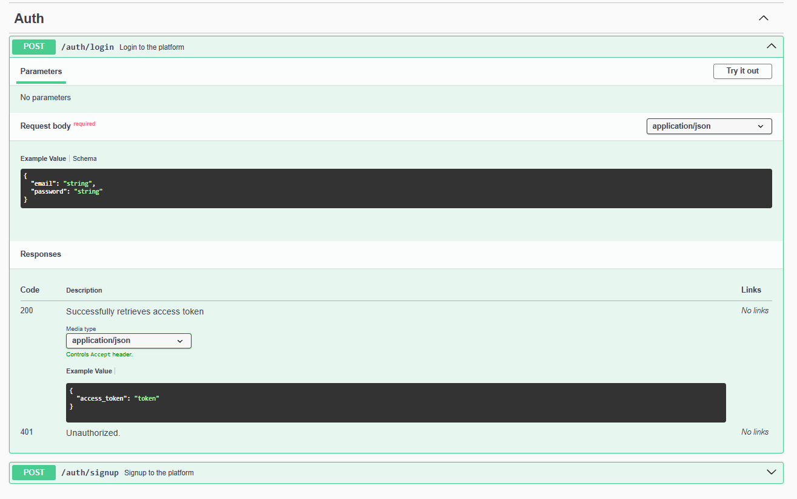

# User Timeline

Esse projeto é um desafio realizado em Nextjs e Microsserviços Nestjs.

O Objetivo era criar uma Timeline em que usuários possam postar e reagir as postagens.

O usuário pode também gerenciar seu perfil como desejar.





## Rodando o projeto

### Requisitos

- Node v20.11.1
- Yarn
- Docker

O projeto está estruturado em workspaces, portanto, os comandos abaixo serão executados na raiz do projeto.

Para o banco de dados eu coloquei no projeto um docker-compose.yml que roda o postgres localmente e o Adminer (http://localhost:8080) para gerar uma GUI de gerenciamento de banco de dados. Certifique-se de que esteja na branch correta (senior)

1. Rode o docker compose para subir o banco de dados:

```
docker compose up -d
```

2. Em seguida, rode o seguinte comando para criar as bases de dados no banco postgres:

```
docker exec -it postgres-timeline psql -U postgres -a -f create_database.sql
```

3. Com o banco rodando e os bancos de cada microsserviço criados, podemos iniciar a configuração inicial do ambiente de desenvolvimento.

   Este comando irá instalar as dependencias do backend e do frontend, copiar os arquivos de ambiente e rodar as migrations no banco de dados:

```
yarn setup
```

4. Para subir o backend, rode o comando:

```
yarn start:microservices
```

5. Para subir o front, rode o comando:

```
yarn start:web
```

## Documentação APIs

Atualmente configurei o Swagger somente na API de Auth, acessando essa URL com o projeto em execução: http://localhost:3000/api

As duas rotas existentes no microsserviço estão bem documentadas e exemplificadas conforme a imagem:



Utilizei o Postman para mapear as requisições e endpoints, o export está nesse arquivo: [docs/User-Timeline.postman_collection.json](docs/User-Timeline.postman_collection.json)

## Overview

A plataforma possui um fluxo de Cadastro (`/auth/signup`) e Login (`/auth/login`) após autenticado o usuário é redirecionado para o Feed (`/feed`). A partir dali o usuário pode criar postagens e reagir a postagens de outros usuários.

Acessando o perfil (`/profile`) é possível editar e listar as próprias postagens e gerenciar postagens curtidas.

## Tecnologias utilizadas

### Backend

O [Nest](https://nestjs.com/) é um framework para criar APIs e utilizei para criar cada microsserviço. O serviço de autenticação utiliza JWT para autenticar o usuário e expira a cada 1 hora.

O Auth Guard foi replicado para os demais microsserviços e eles utilizam a mesma secret no ambiente para destrinchar o token JWT e resgatar o id do usuário autenticado, para assim realizar operações e salvar dados com base no usuário autenticado.

[TypeORM](https://typeorm.io/) foi utilizado para fazer queries ao banco e resgatar dados.

Cada microsserviço possui migrations que mantém a estrutura do banco documentada conforme for atualizado.

### Frontend

O Next foi o framework de frontend de escolha. Utilizando SSR e SSG quando necessário.

O [shadcn](https://ui.shadcn.com/) é uma biblioteca de componentes que utilizei.

Com a utilização do shadcn, os componentes são instalados conforme a necessidade e ficam na pasta `/components/ui`. Alguns eu customizei e salvei em uma pasta alterando o nome do arquivo original para `primitive.tsx`.

Utilizei o [Tailwind](https://tailwindcss.com/) como principal forma de estilizar os componentes.

Utilizei o [Next Auth](https://next-auth.js.org/) para gerenciamento de sessões do usuário, armazenando o token de autenticação JWT retornado no backend para as próximas requisições aos demais microsserviços.

Utilizei o [Next PWA](https://www.npmjs.com/package/@ducanh2912/next-pwa) para utilizar Service Workers e manter o APP rodando em modo Offline (para testar esse fluxo é necessário alterar o NODE_ENV do frontend e rodar os comandos `yarn build` e `yarn start`).

Utilizei o [TanStack Query](https://tanstack.com/query/latest) para realizar a maioria das requisições, com ele é possivel pegar as propriedades de `isLoading` e `isPending` para tornar o app mais dinâmico assim como invalidar queries. (ex.: ao adicionar uma postagem, invalidar a chamada que lista as postagens para serem resgatadas novamente).

Utilizei o [React Hook Form](https://www.react-hook-form.com/) para validação e gerenciamento de formulários no App inteiro.

## Melhorias futuras

- API Gateway para evitar muitas chamadas a diferentes microsserviços;
- Testes unitários e de integração;
- RabbitMQ para replicar dados do perfil do usuário dentro dos posts, com a atualização do usuário o perfil no post é atualizado e mantém a consistencia de dados;
- Validações de formulário (Yup);
- Websocket para manter o feed atualizado;
- Paginação;
- Dynamic import components;
- Deletar perfil;
- Try catches no front e back para evitar erros;
- Cache redis;
- Monitoramento e logs com ELK Stack.
